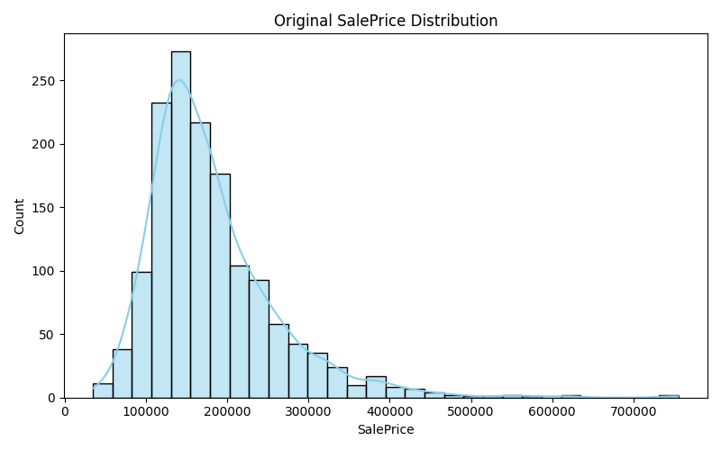
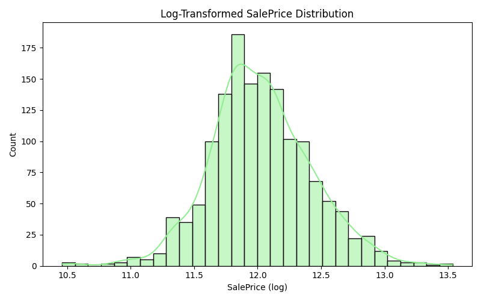
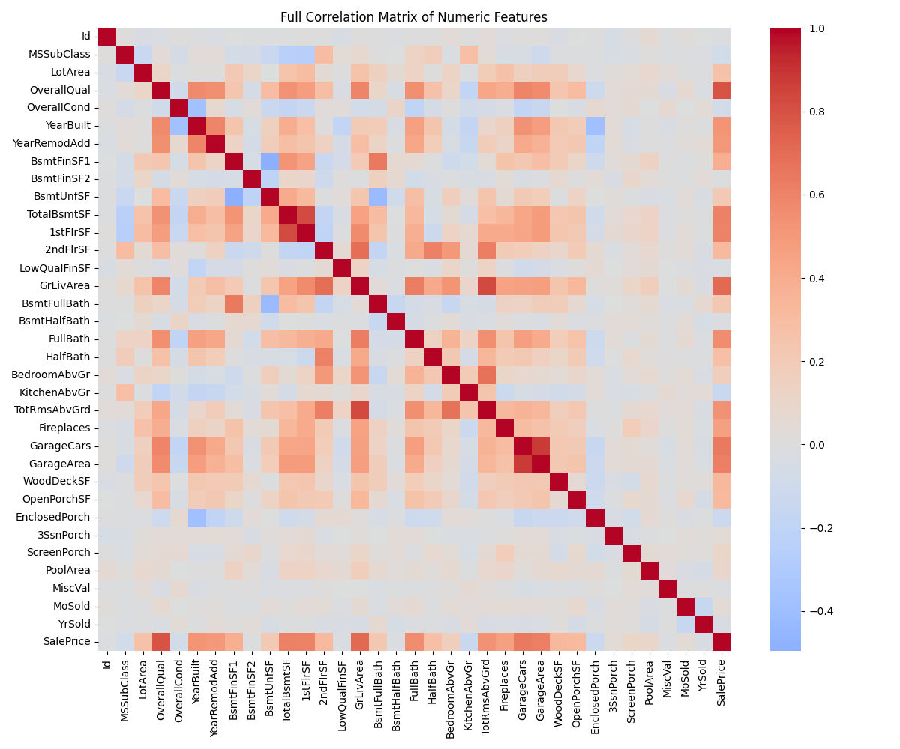
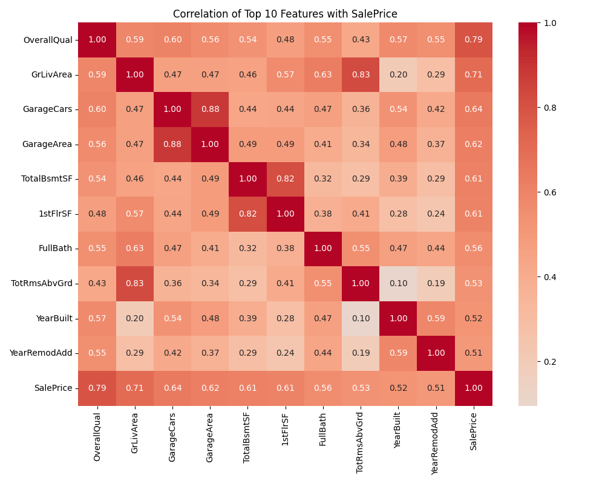

# House Prices Data Assignment

---

### **Purpose**

- Practice end-to-end data analysis using **Pandas** and **Seaborn/Matplotlib**.
- Understand the **Ames Housing dataset** structure (features and target variable `SalePrice`).
- Perform exploratory data analysis, handle missing values, check distributions, calculate correlations, and visualize data.
- Document insights and interpretations as if preparing for a real ML workflow.

---

### **Problem Description**

The **Ames Housing dataset** contains **1460 house sales** in Ames, Iowa, described by **79 explanatory variables**.

The target variable is **`SalePrice`** (the sale price in USD).

This project walks through **data acquisition → investigation → cleaning → distribution analysis → correlation study → interpretation**.

---

## Assignments

### **[Problem 1] Data Acquisition**

- Load the housing dataset from `train.csv`.
- Display first 5 rows and dataset shape.
- Save a copy of the loaded dataset as:
  - `data/train_loaded.csv`

---

### **[Problem 2] Dataset Investigation**

- Understand dataset context and structure.
- Generate basic textual report:
  - Number of rows/columns
  - Sample rows
  - Example columns
- Save reports as:
  - `data/problem2_investigation.md`

---

### **[Problem 3] Checking Data**

- Inspect data types.
- Check target variable `SalePrice`.
- Generate summary statistics for numerical columns.
- Save reports as:
  - `data/problem3_checking_data.md`

---

### **[Problem 4] Dealing with Missing Values**

- Check missing values per column.
- Visualize missingness using **missingno**.
- Calculate percentage of missing values.
- Drop columns with 5 or more missing values.
- Drop rows still containing missing values afterward.
- Save cleaned dataset and report as:
  - `data/train_cleaned.csv`
  - `data/problem4_missing_report.md`
- Missing values plot:
  - `data/missing_values_matrix.png`

---

### **[Problem 5] Researching Terminology**

- Summarize **kurtosis** and **skewness**.
- Understand their role in describing distribution shapes.
- Save research as:
  - `data/problem5_terminology.md`
  - `data/problem5_terminology.txt`

---

### **[Problem 6] Confirming Distribution**

- Plot distribution of target variable `SalePrice` using **Seaborn**.
- Calculate skewness and kurtosis.
- Apply logarithmic transformation: `np.log1p(SalePrice)`.
- Re-plot and recalculate metrics.
- Compare original vs transformed distributions.
- Reports saved as:
  - `data/problem6_distribution.md`
  - `data/problem6_distribution.txt`
- Plots saved in `plots/`:
    
  

---

### **[Problem 7] Confirming Correlation Coefficient**

- Create correlation matrix for all features.
- Visualize correlation heatmap.
- Identify top 10 features most correlated with `SalePrice`.
- Generate a heatmap for top 10 features + `SalePrice`.
- Explain actual meaning of these features using **Kaggle Data Description**.
- Identify 3 pairs of highly correlated features among the top 10.
- Discuss **multicollinearity** and its impact in regression.
- Reports and plots saved as:
  - `data/problem7_correlation_report.md`
- Plots saved in `plots/`:
    
  

---

### **Tools Used**

- Python 3.x
- Pandas
- NumPy
- Matplotlib / Seaborn
- Missingno

---

### **How to Run**

1. Clone the repository or download the files.
2. Navigate into the project directory.
3. Run all tasks sequentially with:

```bash
python main.py
```


#### **Individual problems can also be run separately:**

```bash
python src/problem1_load_dataset.py
python src/problem2_dataset_investigation.py
python src/problem3_checking_data.py
python src/problem4_missing_values.py
python src/problem5_distribution_terms.py
python src/problem6_distribution_analysis.py
python src/problem7_correlation_analysis.py
```

---

## Author

**Assignment:** House Prices Data Assignment

**Name:** Victor Karisa

**Date:** 01/10/2025

```